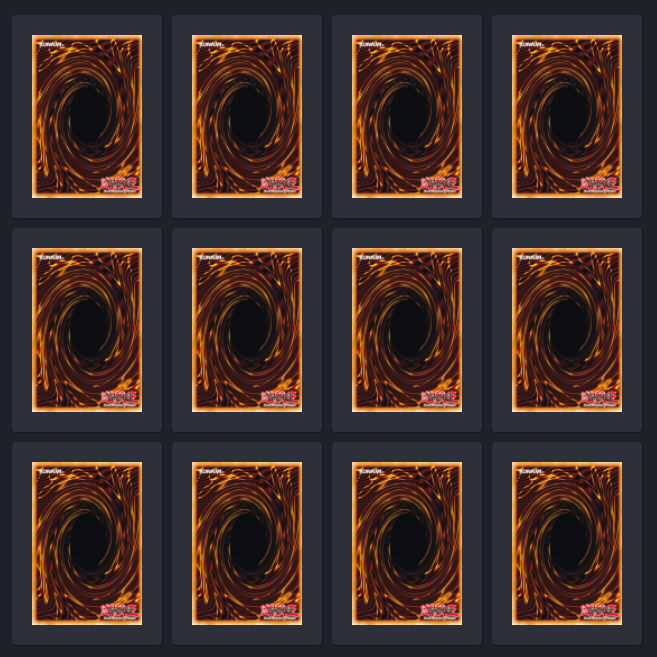

<h1 align="center">
    
</h1>

<h3 align="center">
  :rocket: Simple memory game using HTML, CSS and JS.
</h3>

## :book: About:

 This project was introduced into the bootcamp to talk about some simple concepts using HTML, CSS and JS.

 ## :iphone: Tools:

 <ul>
  <li>HTML</li>
  <li>CSS</li>
  <li>JS</li>
 </ul>
 
## :computer: Running:

1 - Just download the project and open it using any IDE or click here.
